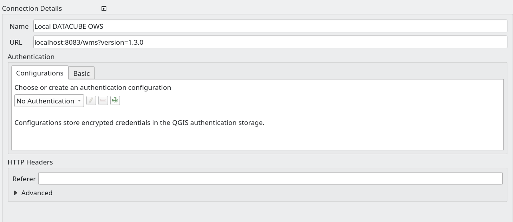

# local-odc-template
A repository template to use for setting up a local ODC deployment

## Setting up WMS in QGIS 

Use the following connection details to connect to the OWS setup in this repository.

``` bash
Local Datacube OWS

localhost:8083/wms?version=1.3.0

```

